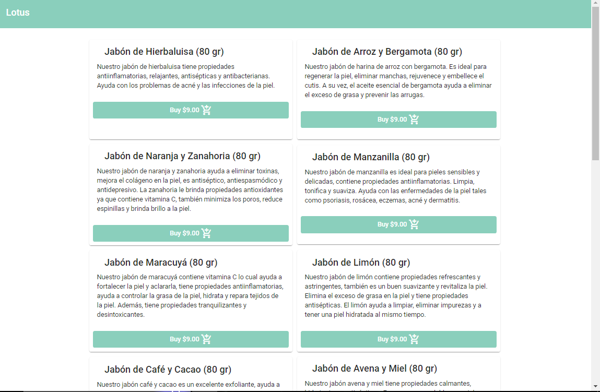
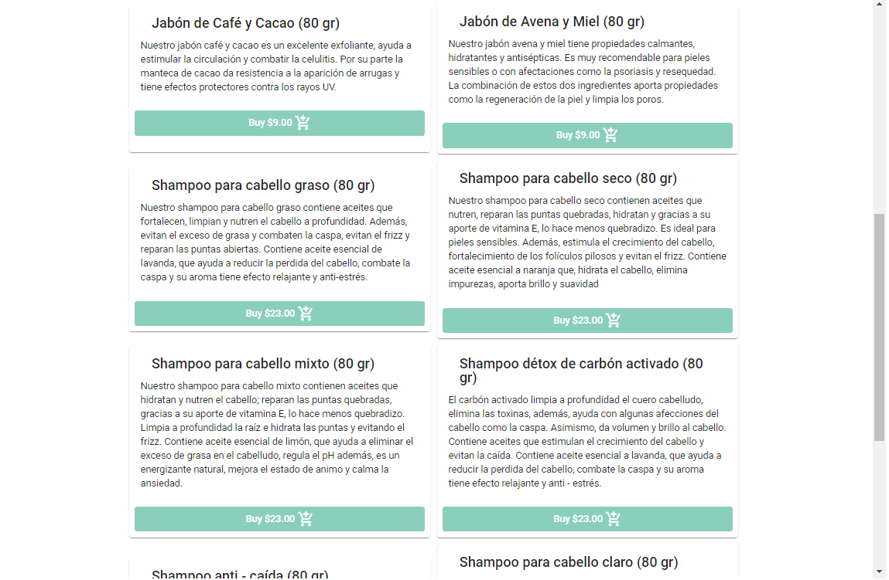
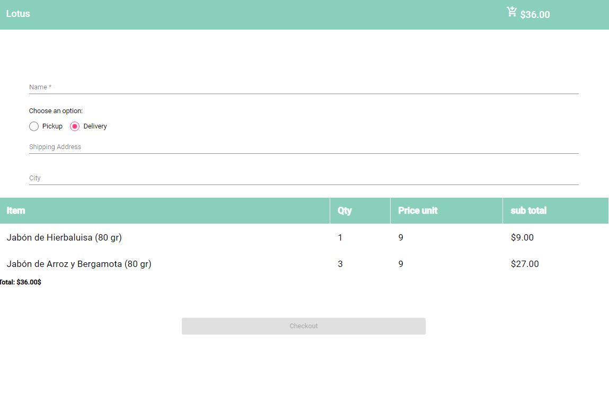
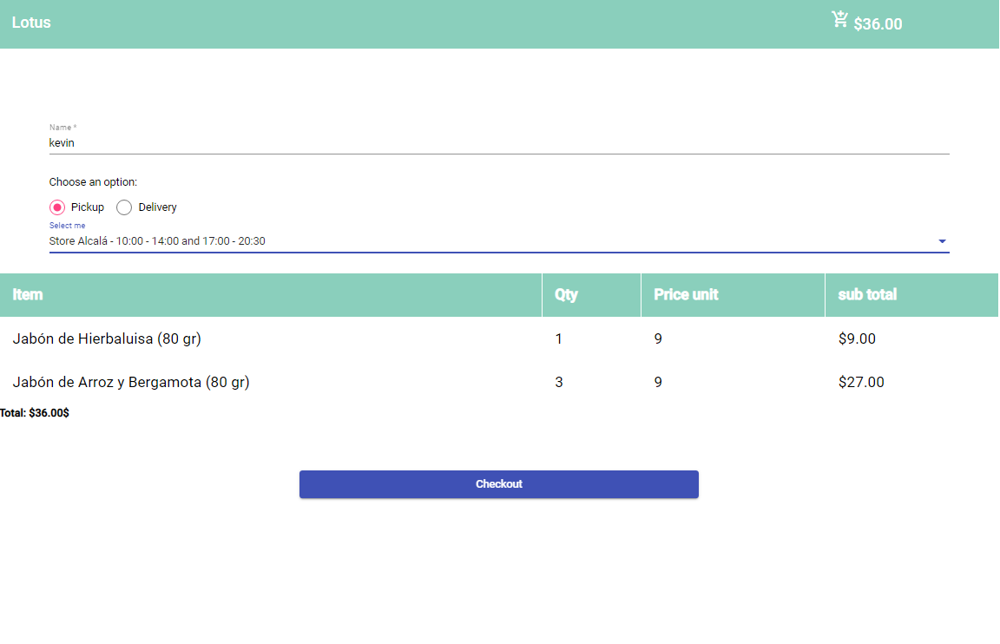
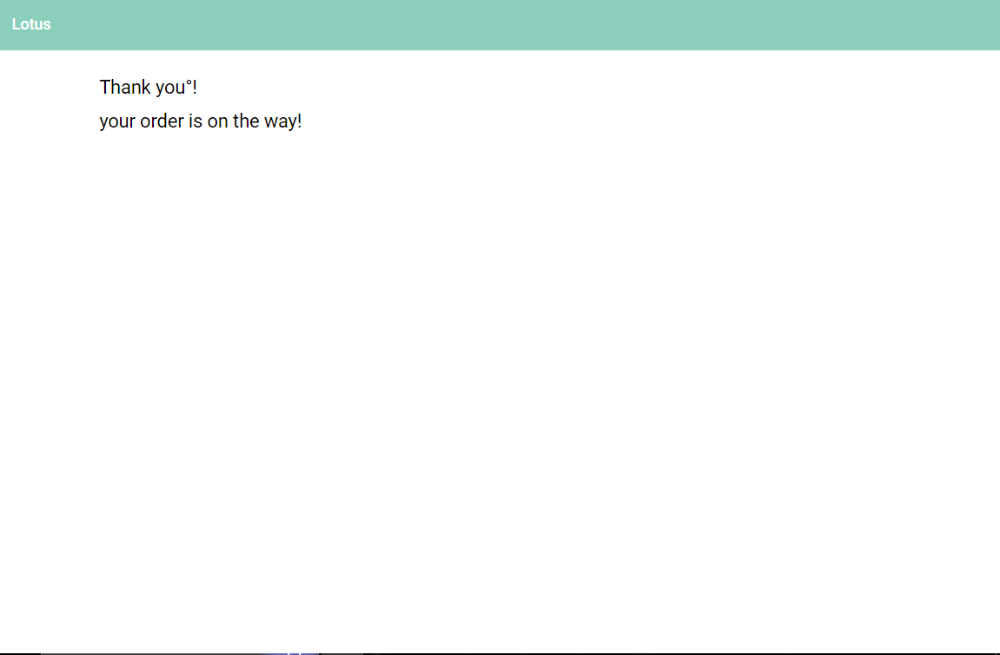
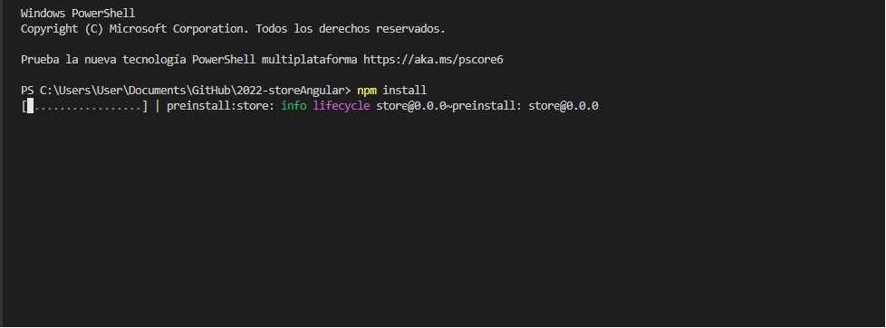
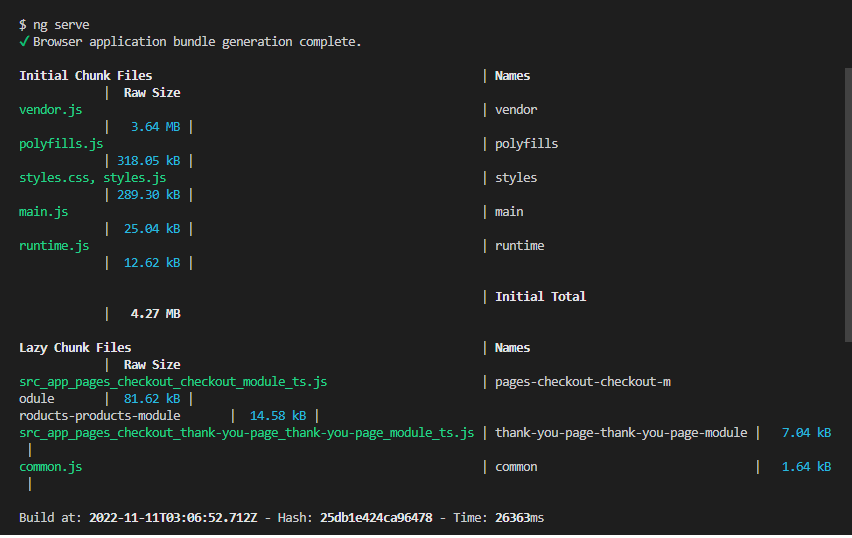
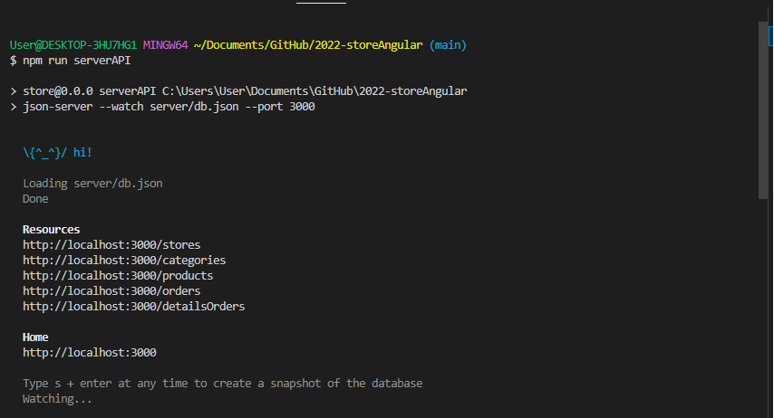

# Welcome to the virtual Page for the purchase of Handmade Soaps, Shampoos and Conditioners! 🧼🧼
An application whose purpose is to show all the items in the inventory to users so that they can choose the items to their preferences and make their respective payment

# Steps to run the project 🚨:

  
  
  
  
  

1.- Once the project is downloaded, access the terminal of your console.

    * - To access open the terminal (Control + Ñ) or (Terminal - New Terminal).
    * - Run the command "npm install"
   

  

                                           
Once having the first step perfectly, we proceed to execute the environments

    * - You need to run both the front-end and the back-end so you have to run it through two separate environments.

   

                                    

## More info about me: 

Ing. Kevin J. Montero Zea 

CE: 004712881 🆔

+51-913-695-382 📱

<a href="https://www.linkedin.com/in/kevin913montero/">
    LinkedIn 👨‍🦰
  </a>

<a href="https://portfoliokjmz.netlify.app/">
    Portfolio 💼
  </a>

